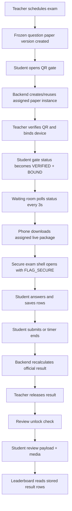

# System Audit: Controlled Examination Flow

## 1. Executive Summary

The controlled exam flow is real and mostly working end-to-end:
- QR verification creates or reuses a student-specific assigned paper instance.
- The student phone receives a locked live package with assigned order and question media metadata.
- The waiting room is not just UI; it actively pulls the assigned package and updates download state.
- Secure attempt mode uses `FLAG_SECURE`, back interception, lifecycle warnings, and violation logging.
- Official scoring, result release, review unlock, and review rendering are server-backed.

The biggest gaps are not around the core exam math. They are around operational robustness:
- assigned paper generation can still race on simultaneous scans,
- the waiting room/secure start flow is still client-driven and memory-only,
- there is no teacher force-submit route,
- leaderboard materialization is not fully guaranteed by the release route,
- offline recovery after app kill is weak,
- a few UI/data mappings are still fragile.

Overall verdict: the implementation matches the intended JEE-style controlled model in architecture, but it is still fragile in edge cases and should be treated as “production-like, not yet hardened.”

## 2. Current Real Flow Diagram



## 3. Backend Package Generation Audit

### 3.1 Assigned paper instance is created in the exam-gate service

- File: `A:/RMC_Local_Installer/Examination/examination-backend/src/modules/exam-gate/assigned-paper.ts`
- Function: `generateStudentAssignedPaperInstance`
- Evidence:

```ts
const existing = await loadAssignedPaperInstance(db, exam.id, student.id);
if (existing) {
  return buildAssignedPackage(existing, exam);
}

const existingCount = await db.student_exam_paper_instances.count({
  where: { exam_id: exam.id },
});
const assignedStudentNumber = existingCount + 1;
const variantSeed = deriveVariantSeed(exam.id, student.id, gateSessionId, assignedStudentNumber, exam.question_paper_version.id);

const created = await tx.student_exam_paper_instances.create({ ... });
await tx.student_exam_paper_questions.createMany({ ... });
```

- Explanation: the instance is created lazily for each student, and the questions are written into `student_exam_paper_questions` before the package is returned.
- Verdict: GOOD, with a RISK note about count-based race conditions.

### 3.2 It is created during QR verification and also pre-generated on QR open

- File: `A:/RMC_Local_Installer/Examination/examination-backend/src/modules/exam-gate/service.ts`
- Functions: `createStudentGateQr`, `verifyStudentGateQr`
- Evidence:

```ts
await generateStudentAssignedPaperInstance(db, exam.id, student.id, session.id);
```

and:

```ts
const assignedPaper = await generateStudentAssignedPaperInstance(db, exam.id, student.id, updated.id);
```

- Explanation: the package is generated as soon as the student opens the QR screen, then reused during teacher verification if it already exists.
- Verdict: GOOD for speed; NEEDS IMPROVEMENT for race-hardening.

### 3.3 Generation is idempotent after the first insert

- File: `assigned-paper.ts`
- Function: `generateStudentAssignedPaperInstance`
- Evidence:

```ts
const existing = await loadAssignedPaperInstance(db, exam.id, student.id);
if (existing) {
  return buildAssignedPackage(existing, exam);
}
```

- Explanation: repeated calls for the same student/exam return the same instance.
- Verdict: GOOD.

### 3.4 assigned_student_number and variant_seed logic

- File: `assigned-paper.ts`
- Function: `generateStudentAssignedPaperInstance`
- Evidence:

```ts
const existingCount = await db.student_exam_paper_instances.count({ where: { exam_id: exam.id } });
const assignedStudentNumber = existingCount + 1;
const variantSeed = deriveVariantSeed(exam.id, student.id, gateSessionId, assignedStudentNumber, exam.question_paper_version.id);
```

and:

```ts
function deriveVariantSeed(examId: number, studentId: number, gateSessionId: number, assignedStudentNumber: number, versionId: number) {
  return hashText([examId, studentId, gateSessionId, assignedStudentNumber, versionId, VARIANT_SALT].join(":"));
}
```

- Explanation: the number is based on current row count; the seed is deterministic for a given exam, student, gate session, assigned number, and version.
- Verdict: GOOD determinism, RISKY fairness/race behavior.

### 3.5 Question selection and shuffle logic

- File: `assigned-paper.ts`
- Function: `generateStudentAssignedPaperInstance`
- Evidence:

```ts
const spreadStep = Math.max(1, Math.floor(available / Math.max(1, Math.ceil(deliverCount / 2))));
const offset = (assignedStudentNumber * spreadStep) % available;
const rotated = rotateArray(questionsInSection, offset);
const chosen = rotated.slice(0, deliverCount);
const ordered = sectionRule.orderStrategy === "ORIGINAL"
  ? [...chosen].sort((left, right) => left.question_order - right.question_order)
  : shuffleDeterministic(chosen, `${variantSeed}:${sectionRule.section.section_code}`);
```

- Explanation: section pools are rotated, then deterministically shuffled or sorted.
- Verdict: GOOD for controlled variety; RISKY if the pool is small.

### 3.6 Insufficient questions are handled by warning, not failure

- File: `assigned-paper.ts`
- Function: `buildAssignedPackage`
- Evidence:

```ts
if (section.question_count_target > 0 && sectionQuestions.length < section.question_count_target) {
  warnings.push(`Section ${section.section_code} delivered ${sectionQuestions.length} of ${section.question_count_target} requested questions.`);
}
```

- Explanation: shortage does not break the flow; the phone receives a warning.
- Verdict: GOOD operationally, NEEDS IMPROVEMENT academically if exact counts are mandatory.

### 3.7 The assigned order is frozen forever

- File: `assigned-paper.ts`
- Function: `buildAssignedPackage`
- Evidence:

```ts
const livePackage: AssignedPaperLivePackage = {
  instance_id: instance.id,
  question_paper_version_id: instance.question_paper_version_id,
  assigned_student_number: instance.assigned_student_number,
  variant_seed_public_id: toPublicVariantSeedId(instance.variant_seed),
  sections,
  warnings,
};
```

- Explanation: the live package is serialized from the stored instance and version snapshot.
- Verdict: GOOD.

### 3.8 Source-paper edits do not affect an already assigned paper

- File: `assigned-paper.ts` and `results/service.ts`
- Evidence:

```ts
question_paper_version_id: exam.question_paper_version.id,
```

and in result/review:

```ts
const version = await loadQuestionPaperVersionSnapshot(db, attempt.exam.question_paper_version_id);
```

- Explanation: the assigned paper and the scoring/review logic both use the immutable version snapshot.
- Verdict: GOOD.

### 3.9 Race condition risk

- File: `assigned-paper.ts`
- Function: `generateStudentAssignedPaperInstance`
- Evidence:

```ts
const existingCount = await db.student_exam_paper_instances.count({ where: { exam_id: exam.id } });
const assignedStudentNumber = existingCount + 1;
```

- Explanation: two near-simultaneous verifications can read the same count before either insert commits.
- Verdict: RISKY. This is the main generation race.

## 4. Waiting Room Audit

### 4.1 The waiting room is not just a label; it drives download

- File: `A:/RMC_Local_Installer/Examination/examination-compose-v2/app/src/main/java/com/example/viewmodel/ExamViewModel.kt`
- Functions: `startStudentGatePolling`, `maybePrepareStudentDownload`
- Evidence:

```kotlin
if (payload.gate?.canEnterWaitingRoom == true) {
    maybePrepareStudentDownload(examId.toString(), payload.gate.deviceId ?: _appDeviceId.value)
}
```

and:

```kotlin
examGateRepository.updatePaperDownloadStatus(examId.toLong(), deviceId, "DOWNLOADING")
val payload = examGateRepository.downloadStudentExamPayload(examId.toLong(), deviceId)
examGateRepository.updatePaperDownloadStatus(examId.toLong(), deviceId, "READY")
payload.assignedPaper?.let { _studentAssignedPaper.value = it }
```

- Explanation: the app polls the gate, marks download status, and fetches the assigned package.
- Verdict: GOOD, but it is client-driven.

### 4.2 Gate status polling is every 3 seconds

- File: `ExamViewModel.kt`
- Function: `startStudentGatePolling`
- Evidence:

```kotlin
while (isActive) {
    delay(3000)
    runCatching { examGateRepository.getStudentGateStatus(examId) }
}
```

- Explanation: the waiting room refreshes periodically rather than via push.
- Verdict: GOOD enough for small cohorts, NEEDS IMPROVEMENT for larger loads.

### 4.3 The waiting room stores package data only in memory

- File: `ExamViewModel.kt`
- Evidence:

```kotlin
payload.assignedPaper?.let {
    _studentAssignedPaper.value = it
    if (_studentSecureAnswerStates.value.isEmpty()) {
        initializeStudentSecureAnswers(it)
    }
}
```

- Explanation: no Room/database/file cache is used for the assigned package.
- Verdict: RISKY. App kill/restart loses the package.

### 4.4 The waiting room can download the package, but not persist it

- File: `StudentScreens.kt`
- Function: `StudentGateScreen`
- Evidence:

```kotlin
val paperProgressStatus = when {
    assignedPaper != null -> "READY"
    assignedPaperState == StudentAssignedPaperUiState.Loading -> "DOWNLOADING"
    gate?.paperDownloadStatus == "FAILED" -> "FAILED"
    ...
}
```

- Explanation: the UI reflects the package lifecycle and readiness.
- Verdict: GOOD UI/state mapping, but still memory-only.

### 4.5 It does not expose answers or solutions in the waiting room

- File: `StudentScreens.kt`
- Function: `AssignedPackageLockCard`
- Evidence:

```kotlin
Text("Answers and review keys stay locked during live exam mode.")
```

and the payload shape in backend:

```ts
assigned_paper: assignedPayload.livePackage,
locked_review_package: assignedPayload.lockedReviewPackage,
```

- Explanation: the live package contains question text/media/options only; answers and solution data are not included.
- Verdict: GOOD.

### 4.6 What happens if internet drops after waiting room

- Evidence from code:

```kotlin
} catch (throwable: Throwable) {
    examGateRepository.updatePaperDownloadStatus(examId.toLong(), deviceId, "FAILED")
    _studentAssignedPaperUiState.value = StudentAssignedPaperUiState.Error(...)
}
```

- Explanation: if the package is not already loaded, the flow fails and the app remains blocked until connectivity returns.
- Verdict: RISKY.

### 4.7 What happens if the app is killed after QR scan but before start

- Evidence from code:

```kotlin
_studentAssignedPaper.value = it
_studentSecureAnswerStates.value = nextStates
```

- Explanation: the assigned package and answer state are not persisted, so the student must reload from the backend.
- Verdict: NEEDS IMPROVEMENT.

## 5. Android Package Handling Audit

### 5.1 QR generation is backed by the backend

- File: `ExamViewModel.kt`
- Function: `refreshStudentGate`
- Evidence:

```kotlin
val payload = examGateRepository.requestStudentGateQr(targetExamId, deviceId)
_studentGateQrPayload.value = payload.qrPayload
```

- Verdict: GOOD.

### 5.2 The student gate payload contains only safe fields

- File: `ExamGateDtos.kt`
- Data classes: `StudentExamDownloadPayloadResponseDto`, `StudentAssignedPaperDto`, `StudentAssignedPaperQuestionDto`
- Evidence:

```kotlin
@SerializedName("assigned_paper")
val assignedPaper: StudentAssignedPaperDto? = null,
@SerializedName("locked_review_package")
val lockedReviewPackage: StudentLockedReviewPackageDto? = null,
```

and:

```kotlin
@SerializedName("assigned_question_id")
val assignedQuestionId: Long,
@SerializedName("version_question_id")
val versionQuestionId: Long,
...
val questionText: String? = null,
val questionMedia: List<StudentAssignedPaperMediaDto> = emptyList(),
val options: List<StudentAssignedPaperOptionDto> = emptyList(),
```

- Verdict: GOOD.

### 5.3 Backend access is always authenticated via repository token

- File: `ExamGateRepository.kt`
- Evidence:

```kotlin
val token = requireToken()
val response = api.downloadStudentExamPayload("Bearer $token", examId, deviceId)
```

- Verdict: GOOD.

### 5.4 The package is cached only in ViewModel memory

- File: `ExamViewModel.kt`
- Evidence:

```kotlin
_studentAssignedPaper.value = it
```

- Verdict: RISKY.

### 5.5 The phone does not cache the package across restart

- Evidence: no Room cache, no encrypted on-disk package store, and no package file repository were found in the inspected Compose paths.
- Verdict: NEEDS IMPROVEMENT.

### 5.6 Question image bytes are not fetched in the waiting room

- File: `StudentScreens.kt` and `ExamViewModel.kt`
- Evidence:

```kotlin
if (assignedPaper != null) { ... }
```

and question media prefetch is in the secure attempt:

```kotlin
LaunchedEffect(currentMedia?.id, currentQuestion?.versionQuestionId) {
    viewModel.loadStudentQuestionPreview(...)
}
```

- Verdict: GOOD for bandwidth; RISKY if you expect images visible before exam start.

## 6. Secure Exam Mode Audit

### 6.1 Entry condition comes from waiting room readiness, but it is not fully strict

- File: `ExamViewModel.kt`
- Function: `startStudentExam`
- Evidence:

```kotlin
if (gate?.gateStatus != "VERIFIED" || gate.deviceBindStatus != "BOUND") {
    refreshStudentGateStatus(examId)
    _statusMessage.value = "Waiting room is not ready for secure exam mode."
    return@launch
}

if (_studentAssignedPaper.value == null) {
    maybePrepareStudentDownload(examId, deviceId)
}

runCatching {
    examGateRepository.startStudentAttempt(examId.toLong(), ensureDeviceId())
}
```

- Explanation: the shell can start while the package is still being prepared.
- Verdict: RISKY. This is acceptable only if you want “start while downloading.”

### 6.2 The start route uses bound device_id

- File: `ExamGateApi.kt` and `ExamGateRepository.kt`
- Evidence:

```kotlin
@POST("api/student/exams/{examId}/start")
suspend fun startStudentAttempt(... @Body request: StudentAttemptStartRequestDto)
```

and:

```kotlin
request = StudentAttemptStartRequestDto(deviceId = deviceId)
```

- Verdict: GOOD.

### 6.3 Assigned paper questions drive the secure shell

- File: `ExamViewModel.kt` and `StudentSecureAttemptScreen.kt`
- Evidence:

```kotlin
val currentQuestion = activeSectionQuestions.getOrNull(activeIndex)
```

and:

```kotlin
assignedPaper?.sections?.firstOrNull { ... }?.questions
```

- Verdict: GOOD.

### 6.4 `FLAG_SECURE` is enabled and cleared around the secure screen

- File: `StudentSecureAttemptScreen.kt`
- Evidence:

```kotlin
window?.addFlags(WindowManager.LayoutParams.FLAG_SECURE)
...
onDispose {
    window?.clearFlags(WindowManager.LayoutParams.FLAG_SECURE)
}
```

- Verdict: GOOD.

### 6.5 Fullscreen/system bars are hidden best-effort

- File: `StudentSecureAttemptScreen.kt`
- Evidence:

```kotlin
controller?.hide(WindowInsetsCompat.Type.systemBars())
controller?.systemBarsBehavior = WindowInsetsControllerCompat.BEHAVIOR_SHOW_TRANSIENT_BARS_BY_SWIPE
...
controller?.show(WindowInsetsCompat.Type.systemBars())
```

- Verdict: GOOD, but best-effort only.

### 6.6 Back button is blocked and logged

- File: `StudentSecureAttemptScreen.kt`
- Evidence:

```kotlin
BackHandler(enabled = true) {
    privacyOverlayMessage = "Back action is disabled during the exam."
    viewModel.logStudentViolation(... violationType = "BACK_ATTEMPT" ...)
}
```

- Verdict: GOOD.

### 6.7 App background/focus loss is logged as a warning overlay

- File: `StudentSecureAttemptScreen.kt`
- Evidence:

```kotlin
if (event == Lifecycle.Event.ON_PAUSE || event == Lifecycle.Event.ON_STOP) {
    privacyOverlayMessage = ...
    viewModel.logStudentViolation(... violationType = "APP_BACKGROUND" / "APP_SWITCH" ...)
}
```

- Verdict: GOOD, but best-effort only.

### 6.8 Low volume warning exists

- File: `StudentSecureAttemptScreen.kt`
- Evidence:

```kotlin
if (currentVolume != null && maxVolume != null && currentVolume < maxVolume) {
    viewModel.logStudentViolation(... violationType = "LOW_VOLUME_WARNING" ...)
}
```

- Verdict: GOOD, but it is advisory only.

### 6.9 Local answer state is kept separately from backend save state

- File: `ExamViewModel.kt`
- Evidence:

```kotlin
val nextStates = linkedMapOf<Long, StudentSecureQuestionAnswerState>()
...
_studentSecureAnswerStates.value = nextStates
```

- Verdict: GOOD for UX, RISKY if the app dies before save.

### 6.10 Can secure mode be bypassed by navigation/back/restart?

- What the code does:
  - back is blocked inside the screen,
  - `FLAG_SECURE` is active inside the screen,
  - but app restart loses in-memory assigned paper state.
- Verdict: NEEDS IMPROVEMENT. A determined user on a personal phone still has OS-level avenues outside the app’s control.

## 7. Answer Save / Submit Audit

### 7.1 Answer save API payload accepts multiple IDs

- File: `student/schemas.ts`
- Evidence:

```ts
question_id?: z.number().int().positive().optional();
assigned_question_id?: z.number().int().positive().optional();
version_question_id?: z.number().int().positive().optional();
```

- Verdict: GOOD.

### 7.2 Frontend currently sends version_question_id, not assigned_question_id

- File: `ExamViewModel.kt`
- Function: `saveSecureQuestionAnswer`
- Evidence:

```kotlin
examGateRepository.saveStudentAttemptAnswer(
    attemptId = attemptId,
    questionId = question.versionQuestionId,
    selectedOptionId = current.selectedOptionId,
    integerAnswer = current.integerAnswer,
    markedForReview = current.markedForReview,
)
```

- Explanation: the frontend is still using `questionId = versionQuestionId`.
- Verdict: NEEDS IMPROVEMENT. Backend accepts it, but assigned_question_id is not sent from the phone.

### 7.3 Backend stores assigned_question_id and version_question_id

- File: `student/service.ts`
- Evidence:

```ts
create: {
  attempt_id: attempt.id,
  question_id: question.id,
  assigned_question_id: assignedQuestion?.assigned_question_id ?? null,
  version_question_id: versionQuestion?.id ?? null,
  ...
}
```

and Prisma schema:

```prisma
assigned_question_id Int?
version_question_id  Int?
```

- Verdict: GOOD.

### 7.4 Backend checks device binding and live status

- File: `student/service.ts`
- Evidence:

```ts
await ensureStudentGateAccess(db, attempt.exam_id, actor, {
  deviceId: attempt.device_id ?? undefined,
  requireLive: true,
});
```

- Verdict: GOOD.

### 7.5 Backend rejects late saves

- File: `student/service.ts`
- Evidence:

```ts
if (attempt.ends_at <= now) {
  await db.exam_attempts.update({ data: { status: "EXPIRED" } });
  throw new Error("Attempt time has expired.");
}
```

- Verdict: GOOD.

### 7.6 Backend validates that selected option belongs to the frozen question

- File: `student/service.ts`
- Evidence:

```ts
const versionOption = versionQuestion.options.find((option) => option.id === input.selected_option_id);
if (!versionOption) {
  throw new Error("Selected option does not belong to this question.");
}
```

- Verdict: GOOD.

### 7.7 Frontend local-only answers are preserved until save succeeds

- File: `ExamViewModel.kt`
- Evidence:

```kotlin
saveStatus = "FAILED"
lastError = ...
...
saveStatus = "SAVED"
```

- Verdict: GOOD for resilience, RISKY because unsaved answers stay in memory only.

### 7.8 Submit recalculates the official result on the server

- File: `student/service.ts`
- Evidence:

```ts
const updated = await db.exam_attempts.update({ data: { status: nextStatus, submitted_at: now } });
const result = await recalculateAttemptResult(db, updated.id);
```

- Verdict: GOOD.

### 7.9 Submit blocks until failed/local-only answers are retried

- File: `ExamViewModel.kt`
- Evidence:

```kotlin
if (pendingOrFailed && !retryFailedSecureSaves(examId)) {
    _studentSecureSubmitUiState.value = StudentSecureSubmitUiState.Error("Retry failed saves before submitting.")
    return false
}
```

- Verdict: GOOD, but can annoy students on flaky networks.

### 7.10 Should final submit include a full answer sheet?

- Current design:
  - no, it submits by saved rows.
  - the backend recomputes from `attempt_answers`.
- Verdict: GOOD for normal operation; NEEDS IMPROVEMENT if you want stronger “single final payload” resilience.

## 8. Result Calculation Audit

### 8.1 Official scoring uses the assigned paper instance first

- File: `results/service.ts`
- Function: `buildVersionResultSnapshot`
- Evidence:

```ts
const assignedPaper = await db.student_exam_paper_instances.findFirst({
  where: { exam_id: attempt.exam_id, student_id: attempt.student_id },
  include: { questions: { orderBy: { student_question_order: "asc" } } },
});
```

and:

```ts
for (const question of assignedPaper.questions) {
  const versionQuestion = versionQuestionMap.get(question.version_question_id);
  const answer = answerMaps.byVersionQuestionId.get(question.version_question_id) ?? ...
}
```

- Verdict: GOOD.

### 8.2 It still has a legacy fallback

- File: `results/service.ts`
- Evidence:

```ts
if (attempt.exam.question_paper_version_id) {
  return buildVersionResultSnapshot(db, attempt);
}
return buildLegacyResultSnapshot(db, attempt);
```

- Explanation: official versioned exams are assigned-paper-first, but legacy compatibility remains.
- Verdict: GOOD compatibility, RISKY if legacy paths are accidentally used.

### 8.3 MCQ / INTEGER / unattempted scoring are all server-side

- File: `results/service.ts`
- Evidence:

```ts
const evaluation = scoreVersionQuestion(question, answer);
if (evaluation.correct) ...
else if (evaluation.wrong) ...
else ...
```

- Verdict: GOOD.

### 8.4 Section results are stored separately

- File: `results/service.ts`
- Evidence:

```ts
await tx.attempt_section_results.createMany({
  data: sortSections(Array.from(sectionTotals.values())).map((section) => ({
    attempt_id: attempt.id,
    section_code: section.section_code,
    score: section.score,
    correct_count: section.correct_count,
    wrong_count: section.wrong_count,
    unattempted_count: section.unattempted_count,
    max_score: section.max_score,
  })),
});
```

- Verdict: GOOD.

### 8.5 Result metadata stores assigned paper instance id

- File: `results/service.ts` and `prisma/schema.prisma`
- Evidence:

```ts
assigned_paper_instance_id: assignedPaper?.id ?? null,
```

and:

```prisma
assigned_paper_instance_id Int?
```

- Verdict: GOOD.

### 8.6 Results list is restricted to released official results

- File: `results/service.ts`
- Evidence:

```ts
where: {
  student_id: student.id,
  exam: { status: "RESULT_RELEASED" },
  attempt_result: { isNot: null },
}
```

- Verdict: GOOD.

### 8.7 Leaderboard uses stored result rows, not source-paper recalculation

- File: `leaderboard/service.ts`
- Evidence:

```ts
const leaderboard = await loadExamResultRows(db, exam.id);
await upsertLeaderboardScope(db, "EXAM", exam.id, rows);
```

and:

```ts
const leaderboard = await loadScopeEntries(db, "EXAM", exam.id);
```

- Verdict: GOOD.

### 8.8 Practice attempts are excluded from official leaderboard

- File: `leaderboard/service.ts`
- Evidence:

```ts
const OFFICIAL_VERSION_SCORING_SOURCE = "QUESTION_PAPER_VERSION";
const OFFICIAL_LEGACY_SCORING_SOURCE = "LEGACY_EXAM_QUESTIONS";
```

- Verdict: GOOD.

## 9. Review / Unlock Audit

### 9.1 Review is blocked until result release

- File: `assigned-paper.ts`
- Function: `issueStudentAssignedPaperReviewUnlock`
- Evidence:

```ts
if (exam.status !== "RESULT_RELEASED") {
  gateError("REVIEW_NOT_RELEASED", 403, "Review is not released yet.");
}
```

- Verdict: GOOD.

### 9.2 Review also requires submitted official attempt

- Evidence:

```ts
if (!attempt || (attempt.status !== "SUBMITTED" && attempt.status !== "AUTO_SUBMITTED")) {
  gateError("ATTEMPT_NOT_SUBMITTED", 403, "Attempt is not submitted.");
}
```

- Verdict: GOOD.

### 9.3 Review unlock is bound to device and gate verification

- Evidence:

```ts
if (!session || session.gate_status !== "VERIFIED" || session.device_bind_status !== "BOUND") {
  gateError("DEVICE_NOT_BOUND", 403, "QR verification is required before unlocking review.");
}
if (deviceId && session.device_id !== deviceId) {
  gateError("DEVICE_BIND_MISMATCH", 403, "Device does not match the verified gate session.");
}
```

- Verdict: GOOD.

### 9.4 Review payload preserves assigned order

- File: `results/service.ts`
- Evidence:

```ts
const assignedQuestionsBySection = assignedPaper
  ? new Map(SECTION_ORDER.map((sectionCode) => [
      sectionCode,
      assignedPaper.questions
        .filter((question) => question.section_code === sectionCode)
        .sort((left, right) => left.student_question_order - right.student_question_order),
    ]))
  : null;
```

- Verdict: GOOD.

### 9.5 Review media is behind authenticated review routes

- File: `student/router.ts` and `results/service.ts`
- Evidence:

```ts
router.get("/results/:attemptId/review/questions/:versionQuestionId/media/:mediaId", ...)
router.get("/results/:attemptId/review/questions/:versionQuestionId/solution/:mediaId", ...)
```

and:

```ts
const absolutePath = media.storage_url.startsWith("/")
  ? `${process.cwd()}${media.storage_url}`
  : `${process.cwd()}/${media.storage_url}`;
```

- Verdict: GOOD. Direct storage URLs are not shown to the phone.

### 9.6 Another student cannot access your review

- File: `results/service.ts`
- Evidence:

```ts
if (actor.role === "STUDENT" && attempt.student.user_id !== actor.id) {
  throw new Error("Attempt not found.");
}
```

- Verdict: GOOD.

## 10. Exam End / Server Control Audit

### 10.1 Teacher close exists

- File: `exams/router.ts`
- Evidence:

```ts
router.post("/:examId/close", async (req, res) => { ... })
```

- Verdict: GOOD.

### 10.2 Teacher release-result exists

- File: `exams/router.ts`
- Evidence:

```ts
router.post("/:examId/release-result", async (req, res) => { ... })
```

- Verdict: GOOD.

### 10.3 The release route only changes exam state in the current source

- File: `exams/router.ts`
- Evidence:

```ts
const exam = await releaseExamResult(parsed.data.examId, req.auth!.user);
...
broadcastExamRealtime({ payload: { action: "result_released", status: exam.status } });
```

- Explanation: there is no force-submit of attempts in this handler.
- Verdict: NEEDS IMPROVEMENT.

### 10.4 Teacher force-submit route was not found

- Evidence: no `force-submit` route matched in the inspected `exams` and `student` routers.
- Verdict: BROKEN relative to a strict centralized-exam model.

### 10.5 Student submit is the current finalization path

- File: `student/service.ts`
- Evidence:

```ts
const updated = await db.exam_attempts.update({ data: { status: nextStatus, submitted_at: now } });
const result = await recalculateAttemptResult(db, updated.id);
```

- Verdict: GOOD, but it makes student-side success the primary finalize path.

### 10.6 Timer-end behavior is client-triggered auto-submit

- File: `StudentSecureAttemptScreen.kt` and `ExamViewModel.kt`
- Evidence:

```kotlin
if (isExpired && !autoSubmitTriggered && assignedPaper != null) {
    autoSubmitTriggered = true
    viewModel.submitSecureAttempt(examId)
}
```

- Verdict: GOOD when online; RISKY when the app is dead or disconnected.

### 10.7 Late save rejection is server-side

- File: `student/service.ts`
- Evidence:

```ts
if (attempt.ends_at <= now) {
  ...
  throw new Error("Attempt time has expired.");
}
```

- Verdict: GOOD.

### 10.8 What happens in the major end-of-exam scenarios

- Student submits manually: backend marks submitted and recalculates the official result.
- Timer reaches zero: client auto-submits if the app is alive.
- Teacher closes exam: backend status changes to CLOSED, but no force-submit is visible in the current source.
- Student app is killed: attempt stays in progress until timeout or later submit/reopen path.
- Network drops: save/submit fail client-side; unsaved answers remain local only.
- Student tries after time over: save is rejected; submit may auto-expire.

- Verdict: NEEDS IMPROVEMENT for teacher control and offline resilience.

## 11. Offline / Cache Audit

### 11.1 There is no durable assigned-package cache in the inspected Compose app

- Evidence:
  - `ExamViewModel` stores `_studentAssignedPaper` in memory.
  - No Room/SQLite package cache classes were found in the inspected Compose paths.

- Verdict: BROKEN for offline continuation.

### 11.2 Question preview bytes are cached only in memory

- File: `ExamViewModel.kt`
- Evidence:

```kotlin
_studentSecureQuestionPreviewBitmaps.value = _studentSecureQuestionPreviewBitmaps.value + (mediaId to bitmap)
```

- Verdict: RISKY.

### 11.3 Review media bytes are cached only in memory

- Evidence:

```kotlin
_studentReviewQuestionPreviewBitmaps.value = ...
_studentReviewSolutionPreviewBitmaps.value = ...
```

- Verdict: RISKY.

### 11.4 Answers are cached locally only in ViewModel state before sync

- Evidence:

```kotlin
_studentSecureAnswerStates.value = ...
```

- Verdict: RISKY.

### 11.5 What should be added later

- Durable package cache or encrypted file store.
- Answer outbox queue.
- Retry worker.
- Checksum validation on the downloaded assigned paper.
- Optional Room DB for attempts/paper metadata.

- Verdict: NEEDS IMPROVEMENT.

## 12. Performance / Scalability Audit

### 12.1 Generation is reasonably efficient

- File: `assigned-paper.ts`
- Evidence:

```ts
await tx.student_exam_paper_questions.createMany({ data: selectedQuestions.map(...) });
```

- Verdict: GOOD for 50-70 students.

### 12.2 Generation still has a concurrency bottleneck

- Evidence:

```ts
const existingCount = await db.student_exam_paper_instances.count({ where: { exam_id: exam.id } });
```

- Verdict: RISKY.

### 12.3 Result recalculation is server-side and uses in-memory snapshot loops

- File: `results/service.ts`
- Evidence:

```ts
for (const question of assignedPaper.questions) {
  const evaluation = scoreVersionQuestion(question, answer);
}
```

- Verdict: GOOD for the tested scale, but needs indexes and monitoring.

### 12.4 Polling interval is the first scaling pain point

- File: `ExamViewModel.kt`
- Evidence:

```kotlin
delay(3000)
```

- Verdict: NEEDS IMPROVEMENT for many concurrent devices.

### 12.5 Media streaming is okay but should stay cached

- File: `student/router.ts`
- Evidence:

```ts
res.setHeader("Cache-Control", "private, no-store");
createReadStream(media.absolutePath).pipe(res);
```

- Verdict: GOOD for security, RISKY for repeated media loads.

### 12.6 Likely indexes already in place

- `student_exam_paper_instances @@unique([exam_id, student_id])`
- `student_exam_paper_questions @@unique([instance_id, student_question_order])`
- `attempt_answers @@unique([attempt_id, question_id])`
- `attempt_results @@index([attempt_id])`

- Verdict: GOOD.

### 12.7 What will work for 50-70 students

- Current package creation, answer save, and result recomputation are probably fine at 50-70 students.
- The first pressure points will be polling, media fetch bursts, and generation races.

## 13. Cheating Prevention Audit

### 13.1 Real controls

- `FLAG_SECURE` on the secure attempt screen.
- Device binding on gate and attempt start.
- QR verification requirement before attempt start.
- Backend rejection of late answer saves.
- Review unlock only after result release and submitted attempt.
- Server-side result recalculation.

- Verdict: GOOD.

### 13.2 Best-effort controls

- Back interception.
- Lifecycle background/focus overlay.
- Low volume warning.
- Fullscreen system bar hiding.

- Verdict: GOOD, but best-effort only.

### 13.3 Missing controls

- No confirmed robust overlay/assistant detection.
- No guaranteed screen-off detection route in the inspected code.
- No multi-window kiosk policy.
- No managed-device enforcement.
- No OS-level lock task mode.

- Verdict: NEEDS IMPROVEMENT.

### 13.4 What Android cannot fully prevent on personal phones

- A determined user can still:
  - kill the app,
  - switch apps if the device allows it,
  - potentially use overlays or accessibility tricks,
  - interfere with connectivity.

- Verdict: BROKEN if you expect kiosk-grade security on unmanaged devices.

## 14. Source Code Evidence Snippets

### 14.1 Assigned paper generation

File: `A:/RMC_Local_Installer/Examination/examination-backend/src/modules/exam-gate/assigned-paper.ts`

```ts
const existing = await loadAssignedPaperInstance(db, exam.id, student.id);
if (existing) {
  return buildAssignedPackage(existing, exam);
}
...
const assignedStudentNumber = existingCount + 1;
const variantSeed = deriveVariantSeed(exam.id, student.id, gateSessionId, assignedStudentNumber, exam.question_paper_version.id);
```

### 14.2 Live payload reaching the phone

File: `A:/RMC_Local_Installer/Examination/examination-backend/src/modules/student/service.ts`

```ts
return {
  exam: mapVersionedExamPaper(versioned).exam,
  attempt: attemptState,
  questions: assignedQuestions,
  gate: mapGateStatus(...),
  assigned_paper: assignedPayload.livePackage,
  locked_review_package: assignedPayload.lockedReviewPackage,
};
```

### 14.3 Secure attempt shell

File: `A:/RMC_Local_Installer/Examination/examination-compose-v2/app/src/main/java/com/example/ui/screens/StudentSecureAttemptScreen.kt`

```kotlin
window?.addFlags(WindowManager.LayoutParams.FLAG_SECURE)
controller?.hide(WindowInsetsCompat.Type.systemBars())
BackHandler(enabled = true) { ... }
```

### 14.4 Save and submit

File: `A:/RMC_Local_Installer/Examination/examination-backend/src/modules/student/service.ts`

```ts
if (attempt.ends_at <= now) {
  await db.exam_attempts.update({ ... status: "EXPIRED" ... });
  throw new Error("Attempt time has expired.");
}
...
const saved = await db.attempt_answers.upsert({ ... });
...
const updated = await db.exam_attempts.update({ data: { status: nextStatus, submitted_at: now } });
const result = await recalculateAttemptResult(db, updated.id);
```

### 14.5 Review unlock

File: `A:/RMC_Local_Installer/Examination/examination-backend/src/modules/exam-gate/assigned-paper.ts`

```ts
if (exam.status !== "RESULT_RELEASED") {
  gateError("REVIEW_NOT_RELEASED", 403, "Review is not released yet.");
}
if (!attempt || (attempt.status !== "SUBMITTED" && attempt.status !== "AUTO_SUBMITTED")) {
  gateError("ATTEMPT_NOT_SUBMITTED", 403, "Attempt is not submitted.");
}
```

## 15. Major Bugs / Risks Found

1. Assigned paper generation can race because `assignedStudentNumber` is derived from a count.
2. Waiting-room package state is memory-only and is lost on app kill.
3. Secure start can begin while the assigned paper is still preparing.
4. No teacher force-submit route was found.
5. Release-result does not itself finalize attempts in the current source.
6. Leaderboard generation depends on stored result rows and can be stale if not regenerated.
7. Frontend save currently sends `version_question_id`, not `assigned_question_id`.
8. Student review/results screens are sensitive to nullable backend fields.
9. Polling every 3 seconds will become noisy with many devices.
10. Managed-device-grade cheating protection is not present.

## 16. Recommended Fix Order

1. Add true assigned-paper persistence or durable cache on the student device.
2. Remove the generation race by making assigned-paper creation transactional/locked.
3. Add teacher force-submit or close-and-finalize flow.
4. Make leaderboard regeneration automatic and deterministic on result release.
5. Move answer saves toward a fuller server-verified answer sheet contract.
6. Reduce polling pressure with push or smarter backoff.
7. Harden null-handling in result/review view models and repositories.
8. Add offline retry queue and checksum validation.
9. Add kiosk/managed-device controls if you want stronger cheating prevention.

## 17. What Is Working Well

- Frozen question-paper versioning is correct.
- Assigned-paper order is preserved.
- Live exam answers are hidden from the student phone.
- Review unlock is server-gated and result-release dependent.
- Result recalculation is server-side, not trusted to the phone.
- `FLAG_SECURE` and back handling are already in place.
- Question media and solution media are separated by route and purpose.
- Leaderboard reads stored result rows rather than recalculating from source questions.

## 18. What Must Be Rethought

- The student phone is still doing too much orchestration.
- Package preparation should not be only in-memory if you want true resilience.
- Teacher close should probably have a server-side finalize option.
- Offline continuation after waiting room is currently weak.
- Kiosk-level exam security cannot be claimed on ordinary personal phones.

## 19. Exact Next Coding Phase Prompt

“Make assigned-paper delivery durable and race-safe: persist the assigned package on device, eliminate the count-based generation race, and add a teacher finalize/force-submit route that can close all in-progress attempts server-side. Keep the live exam secure shell unchanged.”

