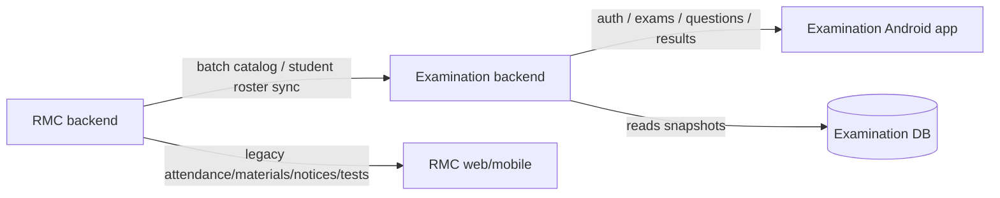

# Examination and RMC Integration Report

## Purpose

This report describes how I would integrate the separate Examination system with the existing RMC backend so the exam app can derive shared master data such as:

- students
- batches/classes
- optionally teacher/admin identities

It also inventories what the two systems currently consist of, so the integration boundaries stay clear before any code is changed.

## 1) Current System Split

### A. Examination system

The Examination product is already separated into its own backend and Android app.

#### Backend modules already present

- `auth`
- `identity`
- `exams`
- `questions`
- `media`
- `student`
- `results`
- `leaderboard`
- `practice`
- `attempts`
- `analytics` placeholder

#### Examination backend data model areas

- users and profiles
- batches
- identity bridge tables
- exams
- exam sections
- questions
- question options
- question media
- exam assignments
- exam attempts
- attempt answers
- attempt section results
- attempt results
- practice unlock tracking
- leaderboard cache rows
- audit logs

#### Examination product rules already enforced

- exactly 3 fixed sections:
  - Physics
  - Chemistry
  - Maths
- only 2 question types:
  - MCQ
  - INTEGER
- `question_media.purpose` only:
  - `QUESTION`
  - `SOLUTION`
- no option image support
- student live payloads must not reveal:
  - correct answer
  - solution media
  - `is_correct` flags

### B. RMC system

The legacy RMC system is a broader operational monolith. It remains the source of existing school/coaching master data and day-to-day workflow data.

#### Main RMC app surfaces

- student login and student portal
- staff login and staff dashboard
- attendance
- batches
- materials
- notices
- reports
- leads / approval flows
- SMS center
- doubts
- tests / launches / scoreboards
- push notifications
- host/admin system controls

#### Main RMC backend data sources relevant to Examination

- `master_student_index`
- `users`
- `batches`
- `batch_catalog`
- `session_students`
- `attendance_sessions`
- `materials`
- `notices`
- `tests` / `launches` / `submissions`
- `doubts`
- `leads`

## 2) What Data Should Come From RMC

For the Examination backend, the right approach is to treat RMC as the source of truth for shared roster/master data, while Examination remains the source of truth for exam content and results.

### Recommended RMC-derived data

1. Student roster
   - student UID
   - student name
   - phone / guardian fields if needed for display or verification
   - active/inactive status
   - current batch/class mapping

2. Batch catalog
   - batch id
   - batch name
   - batch description
   - active/inactive status

3. Optional staff identity
   - teacher/admin username
   - full name
   - role
   - active/inactive status

### Data that should stay owned by Examination

- exams
- question papers
- question images and solution images
- student attempts
- scoring
- results
- leaderboard cache
- practice unlock state

## 3) Recommended Integration Architecture

The cleanest design is a one-way sync from RMC into Examination.

### Principle

- RMC stays the master for roster and batch data
- Examination stores its own local snapshot of the roster
- Examination never becomes dependent on live RMC calls during exam time
- Examination never writes back into RMC

### Why this is the safest model

- exam delivery should not break if RMC is slow
- exam paper creation must remain isolated from old app internals
- sync failures should not stop already-synced exams from working
- the Examination app stays independently deployable

## 4) How I Would Implement It

### Phase 1: Build an RMC connector inside Examination backend

Create a small adapter layer in `examination-backend` that can call RMC APIs for roster and batch data.

It should support:

- fetching batch catalog
- fetching student lists by batch
- fetching summary rosters
- optional staff identity lookup later

### Phase 2: Map RMC records into the Examination identity bridge

The Examination backend already has identity-bridge endpoints and tables for:

- batch upsert
- student verification
- student import
- teacher/admin import

The sync job would:

1. pull batches from RMC
2. upsert them into Examination
3. pull students batch-by-batch from RMC
4. upsert each student into the Examination identity tables
5. mark imported students active/inactive as needed

### Phase 3: Add a sync trigger

I would support both:

- manual sync from an admin endpoint
- scheduled background sync on a timer

That gives you:

- a controllable first import
- a way to refresh data later

### Phase 4: Use local snapshot data in the Android app

The Android app should continue reading from Examination only.

So the app would ask Examination for:

- batches
- students
- exam assignments
- papers
- results

It should not talk directly to RMC for live exam workflow.

## 5) Suggested Data Flow

### Data flow in practice

- RMC remains authoritative for roster and batch master data
- Examination imports that data into its own DB
- Android uses Examination APIs only
- exam results and question papers stay separate from RMC

## 6) Important Mapping Rules

### Student mapping

Likely source in RMC:

- `master_student_index.student_uid`
- `master_student_index.name`
- `master_student_index.batch_name`
- `master_student_index.status`

Likely destination in Examination:

- `student_profiles.uid`
- `student_profiles.name`
- `student_profiles.batch_id`
- `student_profiles.active`

### Batch mapping

Likely source in RMC:

- `batches`
- `batch_catalog`

Likely destination in Examination:

- `batches`

### Teacher/admin mapping

Optional for later.

If needed, Examination can import:

- username
- display name
- role
- active status

But this is not required for the first roster sync.

## 7) What the RMC System Consists Of

Here is the practical inventory of the legacy RMC side that matters for the integration report.

### Core operational areas

- login/session management for staff and students
- student portal
- staff dashboard
- attendance sessions and QR marking
- batch management
- student registration / approval flows
- materials and notices
- reports and exports
- leads and approval workflow
- doubts and replies
- SMS center
- push notifications

### Existing test-related area in RMC

RMC already has a separate tests subsystem with:

- test papers
- launches
- submissions
- scoreboards

That means the old system already understands paper-like concepts, but it is not the same product boundary as the new Examination backend.

### Key RMC backend routes relevant to roster sync

- `GET /api/public/batches`
- `GET /api/batches`
- `GET /api/students`
- `GET /api/students/summary`
- `GET /api/student_details/:uid`
- `GET /api/batches/:name/summary`
- `GET /api/batches/:name/history`

### Key RMC backend tables relevant to roster sync

- `master_student_index`
- `batches`
- `batch_catalog`
- `session_students`
- `users`

## 8) Recommended Integration Order

If I implement this, I would do it in this order:

1. batch sync
2. student sync
3. optional teacher/admin sync
4. reconciliation rules
5. admin/manual sync endpoint
6. scheduled sync job
7. Android UI updates to use the imported roster

## 9) Risks And Constraints

### Risks

- If the Examination app depends on live RMC calls during class/exam time, connectivity failures will cause user-visible problems.
- If the sync mapping is loose, duplicate students or batch mismatches can occur.
- If RMC and Examination both try to own the same roster record, conflicts will happen.

### Constraints

- Do not make RMC the source of exam paper or result logic.
- Do not add option image support.
- Do not expose solution images or correct answers to students.
- Do not modify old RMC app modules while integrating the new backend.

## 10) Recommendation

My recommendation is:

- keep RMC as the master source for students and batches
- import and cache that data inside Examination
- let Examination remain the only system that handles exams, questions, attempts, results, leaderboard, and practice unlock

That gives you a clean separation:

- RMC = roster and school operations
- Examination = testing and scoring

## 11) Next Step If You Approve

If you approve this direction, the next implementation step should be:

1. add an RMC sync adapter to the Examination backend
2. map public/staff RMC roster endpoints into the identity bridge
3. import the current batches and student roster
4. expose a simple admin sync trigger for manual refresh

